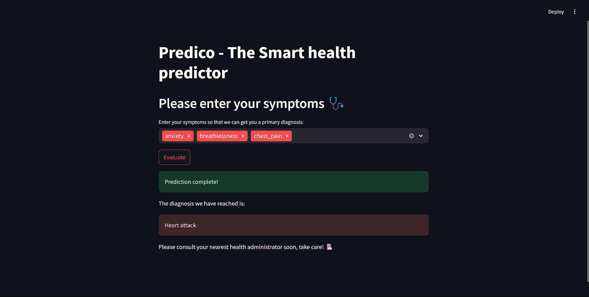

# 🩺 Smart Health - Disease Prediction using Data Mining 🧠💻

This project, **Smart Health**, uses data mining techniques to predict diseases based on patient symptoms. It employs the Random Forest Classifier as the primary machine learning model and provides a user-friendly interface powered by Streamlit. 🌟

---

## 📚 Table of Contents
1. 📖 Overview  
2. ✨ Features  
3. 📂 Project Structure  
4. ⚙️ Setup Instructions  
5. 🚀 Usage  
6. 🛠️ Technologies Used  
7. 📊 Dataset  
8. 🙏 Acknowledgements  

---

## 📖 Overview

**Smart Health** is a machine learning-based web application designed to assist in diagnosing diseases. It uses a dataset of patient symptoms to train a predictive model and provides insights into the likelihood of various diseases. 🧬  

### Key Highlights:
- 🔍 **High-accuracy predictions** using Random Forest.  
- 🌐 A **Streamlit-based interactive and intuitive web application**.  

---

## ✨ Features

- ✅ Train and save machine learning models with ease.  
- 📈 Evaluate model performance on validation and test data.  
- 🔮 Predict diseases based on symptoms or test datasets.  
- 🖥️ User-friendly and interactive UI for non-technical users.  

---

## 📂 Project Structure

```plaintext
smart_health/
│
├── dataset/
│   ├── training_data.csv    # 📄 Training dataset
│   ├── test_data.csv        # 📄 Test dataset
│
├── saved_model/
│   └── random_forest.joblib # 🛠️ Saved model
│
├── venv/                    # 🌐 Python virtual environment
│
├── app.py                   # 🖥️ Streamlit app file
├── config.yaml              # ⚙️ Configuration file
├── main.py                  # 🧠 Script for training the model
├── test_model.py            # 🔬 Script for testing the model
├── requirements.txt         # 📦 Python dependencies
```

---

## ⚙️ Setup Instructions

1. **Clone the repository**:
   ```bash
   git clone <repository-url>
   cd smart_health
   ```

2. **Create a virtual environment**:
   ```bash
   python -m venv venv
   source venv/bin/activate  # On Windows: venv\Scripts\activate
   ```

3. **Install dependencies**:
   ```bash
   pip install -r requirements.txt
   ```

4. **Update the configuration**:
   Edit the `config.yaml` file to specify paths for datasets, saved models, and other parameters. 📝

5. **Run the application**:
   ```bash
   streamlit run app.py
   ```

---

## 🚀 Usage

### 🧠 Training the Model
1. Specify the model type (e.g., Random Forest) in `main.py`.  
2. Run the script:  
   ```bash
   python main.py
   ```
   The trained model will be saved in the `saved_model/` directory. 🛠️  

### 🔬 Testing the Model
Evaluate the model's performance using `test_model.py`:
```bash
python test_model.py
```

### 🌐 Using the Streamlit App
Launch the app:
```bash
streamlit run app.py
```
Use the web interface to make disease predictions. 🖥️✨  

---

## 🛠️ Technologies Used
- **Python 🐍**: Core programming language.  
- **Streamlit 🌐**: For building the web interface.  
- **Scikit-learn 📚**: For machine learning models.  
- **Pandas 🐼**: For data manipulation.  
- **PyYAML 📝**: For configuration management.  

---

## 📊 Dataset

The project uses two datasets:
1. **training_data.csv**: 📄 Dataset for training the model.  
2. **test_data.csv**: 📄 Dataset for testing the model.  

Each dataset includes:  
- 🩺 **Patient symptoms** (features).  
- 🏥 **Disease prognosis** (labels).  

---

## 🙏 Acknowledgements
- 📘 **Scikit-learn Documentation** for machine learning references.  
- 🌟 **Streamlit Community** for guidance on app development.  


### Example Usage Screenshot

Below is an example of the **Smart Health Predictor** in action:




---
